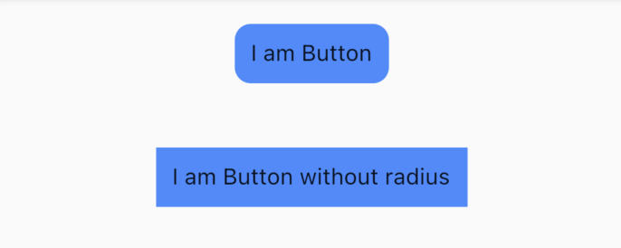
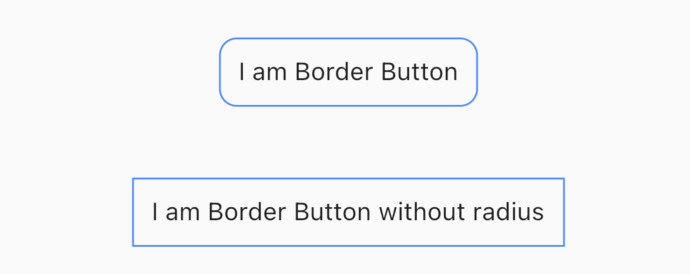
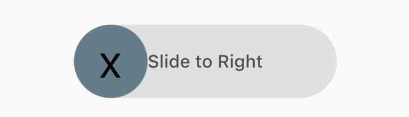
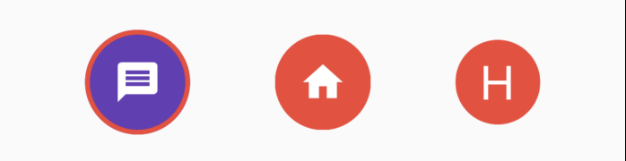
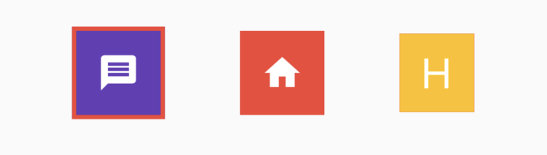

# Flutter Buttons

[](https://choosealicense.com/licenses/mit/)

A Flutter package to create diffrent type of buttons.


## Getting Started

You must add the library as a dependency to your project.
```yaml
dependencies:
  buttons_flutter: ^0.0.1
```

You should then run `flutter pub get`

Now in your Dart code, you can use:

```dart
import 'package:buttons_flutter/buttons_flutter.dart';
```

## Usage Example

It very simple to use.

### Standard Button

```dart
        Button(
            borderRadius: 10,
            bgColor: Colors.blueAccent,
            margin: const EdgeInsets.symmetric(
              horizontal: 10,
              vertical: 20,
            ),
            onPressed: () {
              // some method calls
            },
            child: Text("I am Button"),
          )
```

 

### Border Button

```dart
       BorderButton(
            borderRadius: 10,
            borderColor: Colors.blueAccent,
            margin: const EdgeInsets.symmetric(
              horizontal: 10,
              vertical: 20,
            ),
            onPressed: () {
              // some method calls
            },
            child: const Text("I am Border Button"),
          ),
```

 

### Slider Button

```dart
       SliderButton(
              buttonColor: Colors.blueGrey,
              alignLabel: Alignment.center,
              action: () {
                ///Do something here
                showSnack(context, "Slider button action triggered");
              },
              label: const Text(
                "Slide to Right",
                style: TextStyle(
                  color: Color(0xff4a4a4a),
                  fontWeight: FontWeight.w500,
                  fontSize: 17,
                ),
              ),
              icon: const Text(
                "x",
                style: TextStyle(
                  color: Colors.black,
                  fontWeight: FontWeight.w400,
                  fontSize: 44,
                ),
              ),
            )
```



### Rounded Icon Button

```dart
       RoundedIconButton(
                borderColor: Colors.red,
                bgColor: Colors.red,
                borderWidth: 0,
                child: const Padding(
                  padding: EdgeInsets.all(15.0),
                  child: Icon(
                    Icons.home,
                    size: 30.0,
                    color: Colors.white,
                  ),
                ),
                onPressed: () {
                 // some method calls
                },
              ),
```




### Rect Icon Button

```dart
       RectIconButton(
                borderColor: Colors.red,
                borderWidth: 3,
                child: const Padding(
                  padding: EdgeInsets.all(15.0),
                  child: Icon(
                    Icons.message,
                    size: 30.0,
                    color: Colors.white,
                  ),
                ),
                onPressed: () {
                  // some method calls
                },
              ),
```




### Support

<a href="https://www.buymeacoffee.com/manishdayma" target="_blank"></a>


